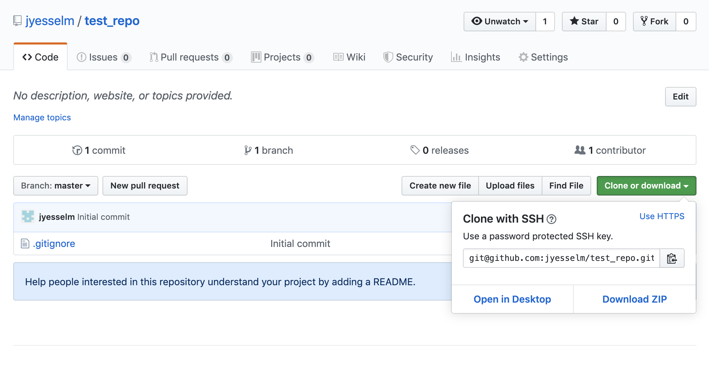
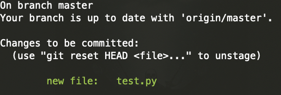
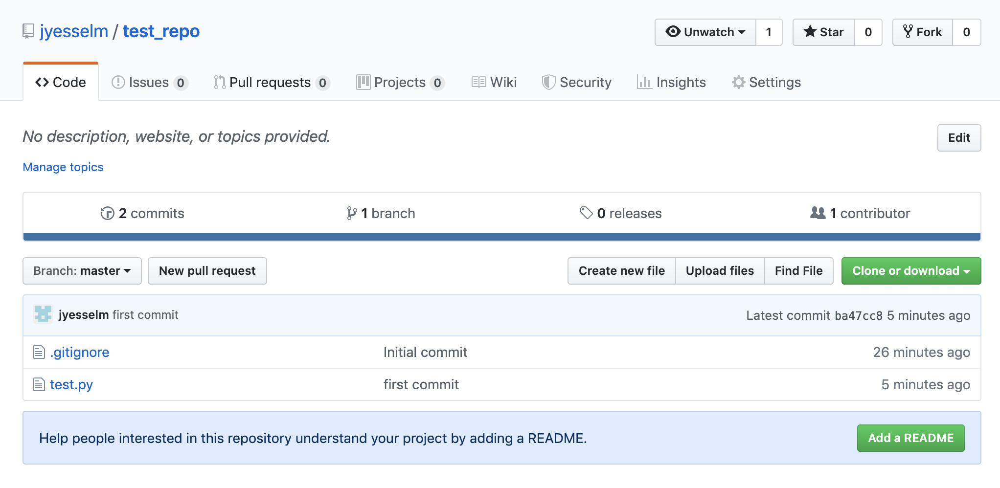
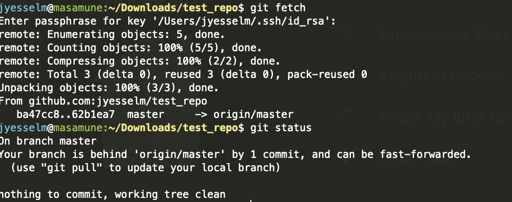

# Lesson 7: Introduction to git

Git is a version control system of code projects. Basically it allows you to save and share your progress with other people, and work together on large projects. It also allows you to revert to older versions of your code if you made a mistake, or to make changes and not affect your release version. 

## Setting up git 

For mac and linux it should already be setup. Although if you wish ther are graphical versions of it too. 

Download the windows version here: https://git-scm.com/downloads

## Creating a new github repo 

Go to github and click "New" the green button 


After you fill everything out and click "Create repository"


Here is an empty repo, now we will go over the basic git commands


## Basic git commands 



```shell
# git has serveral sub commands
# git clone make a copy of an existing repository. 
# this would make a copy of the test repo 
$ git clone git@github.com:jyesselm/test_repo.git

# change directories into the new folder you just made with the git 
# repository in it 
$ cd test_repo 

```


```shell
# see the status of the git repository 
$ git status
```


We are currently on branch master (the main branch) and there is nothing we need to do since this is a new repository. Lets add a file 

```shell
$ cat test.py
print("hellow world")

# lets look at git status again
$ git status
```


Now git sees there is a new file test.py but it is not part of the repository. We can add it with `git add`

```shell
# when you are in a git repository you can
# add files to the repository or files that have been changed 
# git add test.py 

# lets look at git status to see what has changed
# git status
```



Now git is getting ready to track test.py but its not final yet. We need to commit the change to make it final.

```shell
# adds all files and changes to the repository with the message 
# "first commit"
$ git commit -a -m "first commit"
```


Now the changes are made on your computer but no other person will have access to them. To share your changes with everyone we need to push the changes to github.

```shell
# sends the changes back to github 
$ git push origin 
```


Gihub looks like this now, the file is now available.




## Working with multiple branches 

We have covered how you can contribute to a repository but we have not covered getting changes from other people. From now on we will not be working with the master branch other than to add our changes in the end. Why is this?

Suppose there is another person working on this same repo. I will make another copy of the repo 

```shell
$ git clone git@github.com:jyesselm/test_repo.git

# I will add a new line in test.py in this new repo
$ cat test.py 
print("hello world")
print("hello world 2")

# add now I will save my changes
$ git add test.py
$ git commit -a -m "made a change to test.py"
$ git push origin 
```

So now if I go back to first copy of test_repo and do

```shell
# this queries github to see if anyone has made changes 
$ git fetch 
$ git status
```



Now git is aware there are other changes on master branch that we do not have. If we were to try and add our own changes this would happen 

```shell
$ cat test.py
print("hello world")
print("new second line")

$ git add test.py
$ git commit -a -m "made another change to test.py"
$ git push origin 
```


github rejected this push because it would override the existing changes that I made on the other repo. what I need to do instead in `git pull` to get the changes from github and then add my own. But the problem is if I do this

```shell
# pull changes from github
$ git pull
```


If I try to pull I get a new error saying I cant do this either since I will destroy my own local changes. This is a common thing that happens when you try and do all your work on the master branch. The solution is to make a new branch to avoid this.

```shell
# undos the last commit 
$ git reset HEAD~
# creates a new branch
$ git checkout -b new_branch
# lists branches
$ git branch
```
On this new branch `new_branch` I can make all the changes I want and then merge the changes back into `master` after I pull all the changes from github

```shell
$ git add test.py
$ git commit -a -m "made another change to test.py"
$ git checkout master
$ git pull origin
$ git merge new_branch
$ git push origin 
```

Merge allows you to move the changes from `new_branch` to `master` after you get all the changes from github


