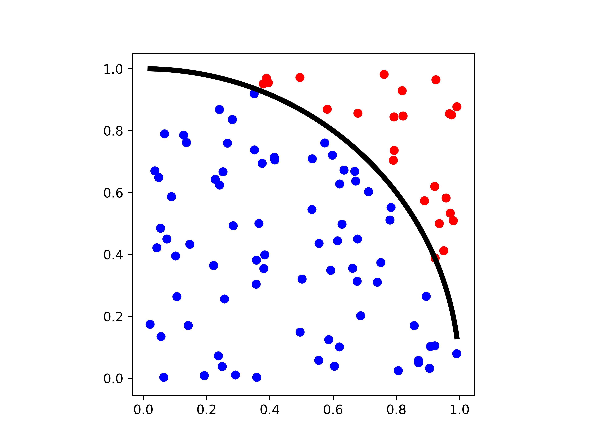
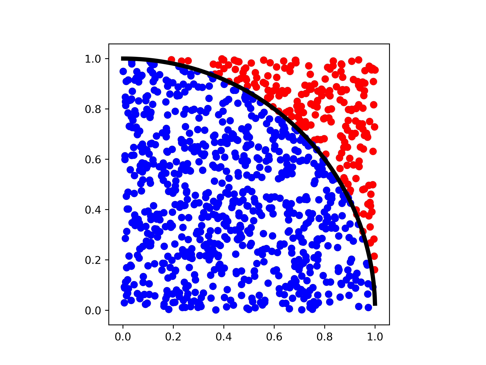
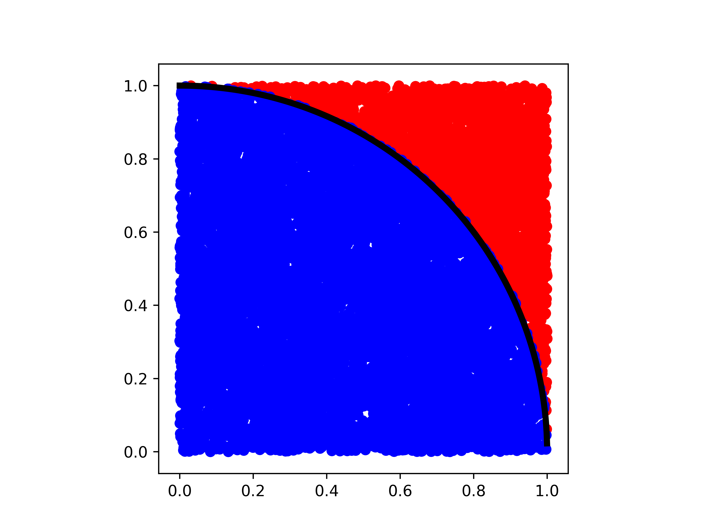

# Monte Carlo and working with the cluster part 2

### Quick review of vi

```shell
# $ means shell command you do not need to enter it 
$ vi file.txt

```

when entering vi press ``i`` to enter insert mode, this will allow you to type or paste information 

`:` exits insert mode 

`:wq` write (or save) and quit out of vi 

`:q!` exits vi without saving


### Transfering files to and from the cluster

```shell
# scp allows you to transfer files to and from the cluster depending on the syntax 
# here I am transfering test.py file to my home directory 
# it works like ssh to log into the cluster but following your username and computer name has a : has the location you wish to transfer the file
$ scp test.py jyesselm@crane.unl.edu:~/
Password: 
Duo two-factor login for jyesselm

Enter a passcode or select one of the following options:

 1. Duo Push to XXX-XXX-2222
 2. Phone call to XXX-XXX-2222
 3. SMS passcodes to XXX-XXX-2222
Passcode or option (1-3): 1
test.py                                                        100% 1042    41.3KB/s   00:00                                                                            
```


### What is Monte Carlo?

http://www.iitg.ac.in/nwast2015/slides/sbs.pdf

Monte Carlo method is a common name for a wide variety of stochastic techniques. These techniques are based on the use of random numbers (sampling) and probability statistics to investigate problems. In general, to call something a "Monte Carlo" method, all you need to do is use random numbers to examine your problem.

### Monte Carlo Integration 

The math behind this is a little complicated and you can check out the deviation in the tutorialMC.pdf also in this directory. 

$$\displaystyle\int_{a}^{b}f(x)dx \approx \frac{b - a}{n}\sum_{i=1}^{n}f(x_i) $$

This approximation allows us sample a large number of random points under the curve of any function to calculate its integral. For simple equations this is not necessary but since this can work in n-dimensional space this can be quite powerful and is used in many application.

What does this look like in python:

```python
# within monte_carlo.py
def integrate(x1, x2, func, n=10000):
    # estimate maximum of function
    point_along_function = np.linspace(x1,x2,1000)
    y1 = min((func(point_along_function)))
    y2 = max((func(point_along_function)))
    check = []
    xs = []
    ys = []
    for i in range(n):
        x = np.random.uniform(x1,x2,1)
        xs.append(x)
        y = np.random.uniform(y1,y2,1)
        ys.append(y)
        if y > func(x):
            check.append(0)
        else:
            check.append(1)

    area = (x2-x1)*(y2-y1)
    return(np.mean(check)*area, xs, ys, check)
  

```


$$\pi$$ is 3.141592653589793

In each of the plots shown below, blue points are under the curve and are included while red are excluded. The fraction of points within the curve multipled by area of the square yields the area under of the curve. 

With 100 points $$\pi$$ is estimated to be 3.08



with 1,000 points $$\pi$$ is estimated to be 3.152



with 10,000 points $$\pi$$ is estimated to be 3.1388



with 100,000 points $$\pi$$ is estimated to be 3.14476


| # of points | $$\pi$$ |
| ----------- | ------- |
| 100 | 3.08 |
| 1,000 |  3.152 |
| 10,000 |  3.1388 |
|  100,000 |   3.14476 |
| 1,000,000     | 3.13946 |
|  10,000,000           |3.14148|

At 10 million points $$\pi$$ is only off by 0.0001!


### Scripts of submitting multiple jobs 

In the class assignment I want everyone to look at how close monte carlo integration gets to the answer for a few functions, this will require everyone to submit multiple jobs at the same time and collecting the data.\

How can we go about this? if we have a program called ``test.py`` we can use command line arguments to change the number of steps.

```python
import sys 
import monte_carlo

# we run the program with python test.py 1 
print(sys.argv[1])

#output
1 

# so now we can do 
def func(x):
  return 1 + np.sin(x)

# have the steps be dependent on the input 
area, x, y, check = monte_carlo.integrate(0, 1, func, int(sys.argv[1]))


```


Now we can setup a submission script 

```python
import os

steps = [10, 100, 1000, 10000, 100000, 1000000, 10000000]

f_sum = open("README")

os.mkdir("runs")
i = 0
for s in steps:
  job_str = """
  #!/bin/bash                                                                
	#SBATCH -t 1:00:00
	#SBATCH -o out.txt
 
  python ../../test.py """ + str(s)
  
  os.mkdir("runs/" + str(i))
  
  job_path = "runs/" + str(i) + "/" + str(i) + ".sh"
  f = open(job_path, "w")
  f.write(job_str)
  f.close()
  
  f_sum.write("sbatch " + job_path)
  
f_sum.close()
```


