## Molecular Dynamics 2: analyzing trajectories 

Some basic analysis 

```shell
# concat the runs into a single trajectory file
$ gmx trjcat -f runs/*/md_0_1.trr

# converts conformations from trajectory into pdb format
$ gmx trjconv -f trajout.xtc -o trj.pdb -s md_0_1.tpr 

# lets get that pdb, do this from another terminal window 
# your directory will be different
scp jyesselm@crane.unl.edu:/work/yesselmanlab/jyesselm/chem_991e/md/trj.pdb .

# lets also do some basic clustering on the joint
$ gmx cluster -f trajout.xtc -cl clusters.pdb -s md_0_1.tpr -cutoff 0.15

# can copy this back to your computer by 
scp jyesselm@crane.unl.edu:/work/yesselmanlab/jyesselm/chem_991e/md/clusters.pdb .

```


### Download pymol

Fill out form here to get a free copy of pymol for the class

https://pymol.org/edu/?q=educational

download the **PyMOL 1.7.4 (August 2015)** verision 


## Visualizing the trajectory in pymol

Open the try.pdb with pymol

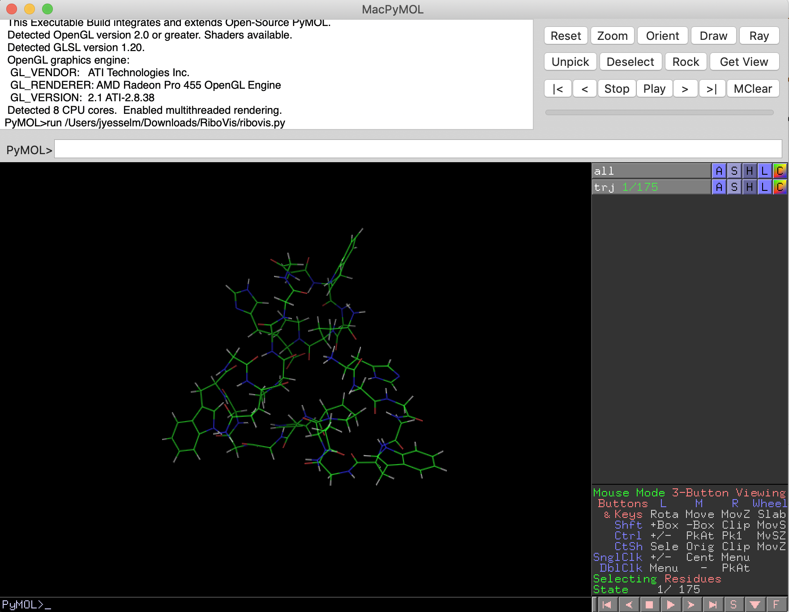


Lets first make it look more pretty before watching the simulation.

First on the right click next to trj there is a S click on it -> as -> cartoon

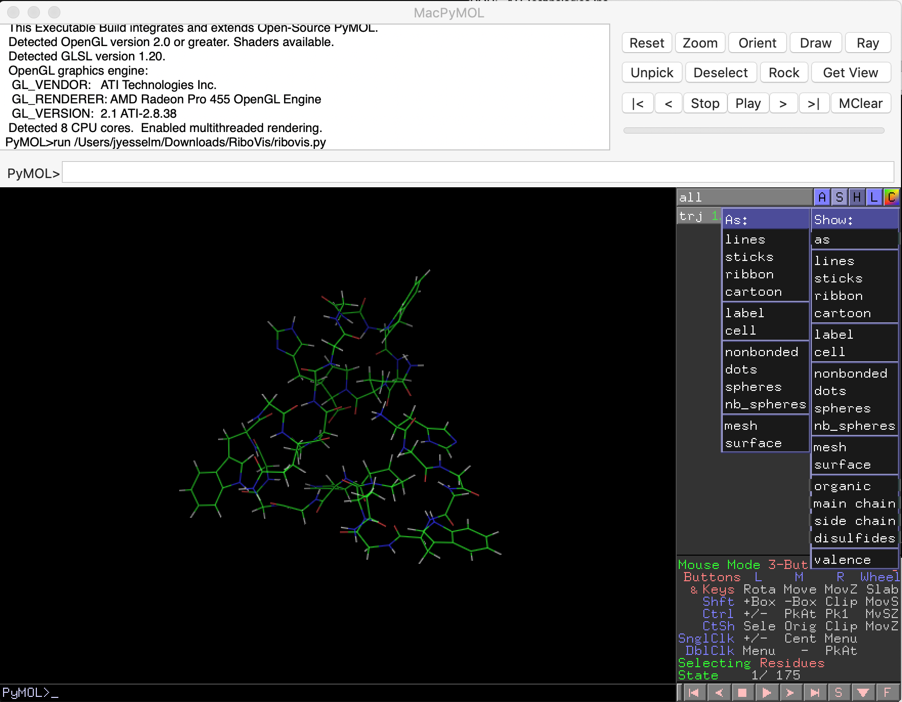


Then again on S -> sticks. Will look like this in the end

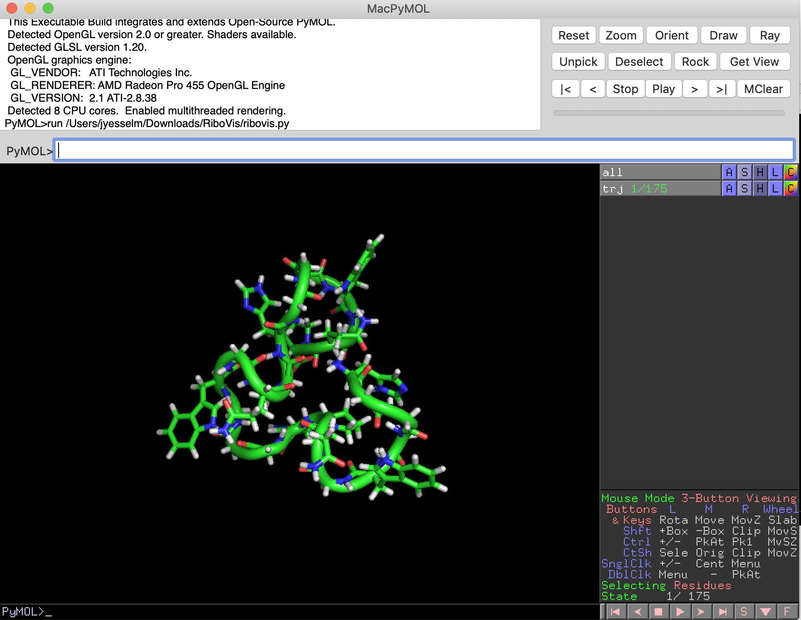


Now lets remove the hydrogens since they make it harder to see whats happening

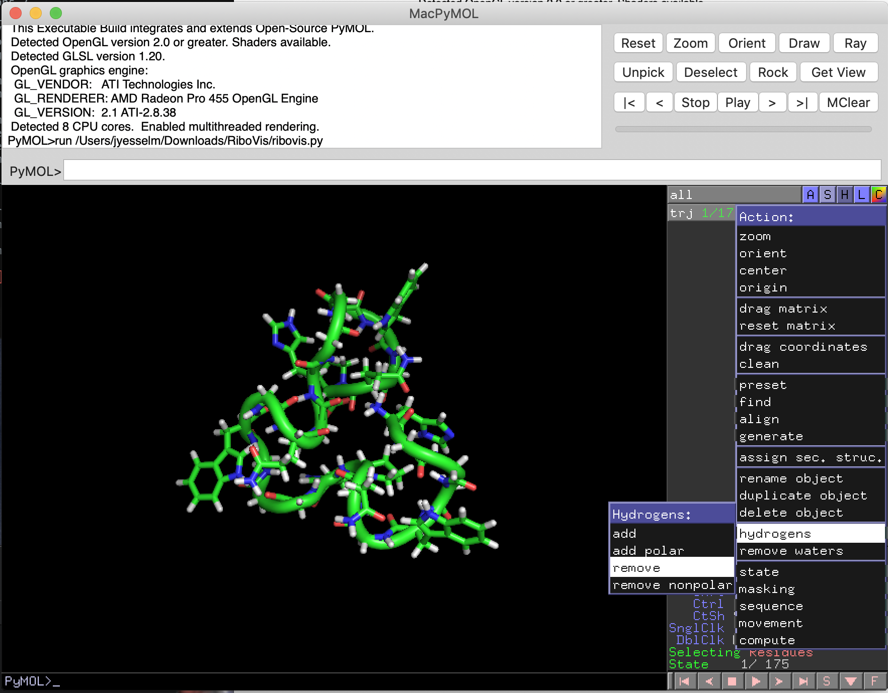


Lastly lets change it to a white background

display -> background -> white

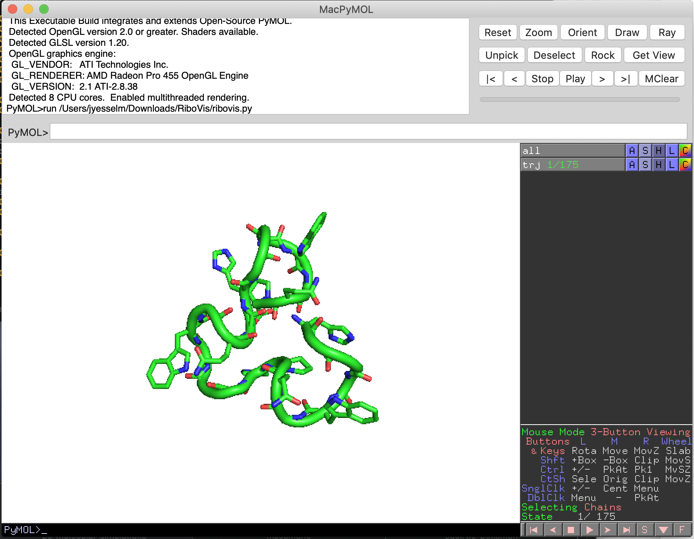


Finally lets watch the movie! Hit Play in the top right. Close pymol and lets now open clusters.pdb 

We can look at all 7 at once by going to movie -> show all states 

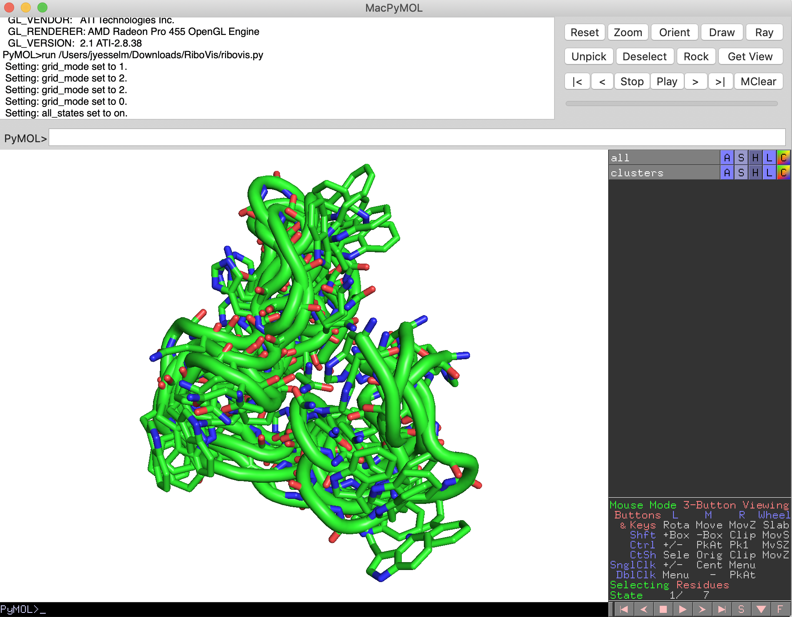

That is kinda hard to see whats going on! So there is another nice way to look at multiple states at once. Go and uncheck movie -> show all states 

Now go display -> grid -> by state

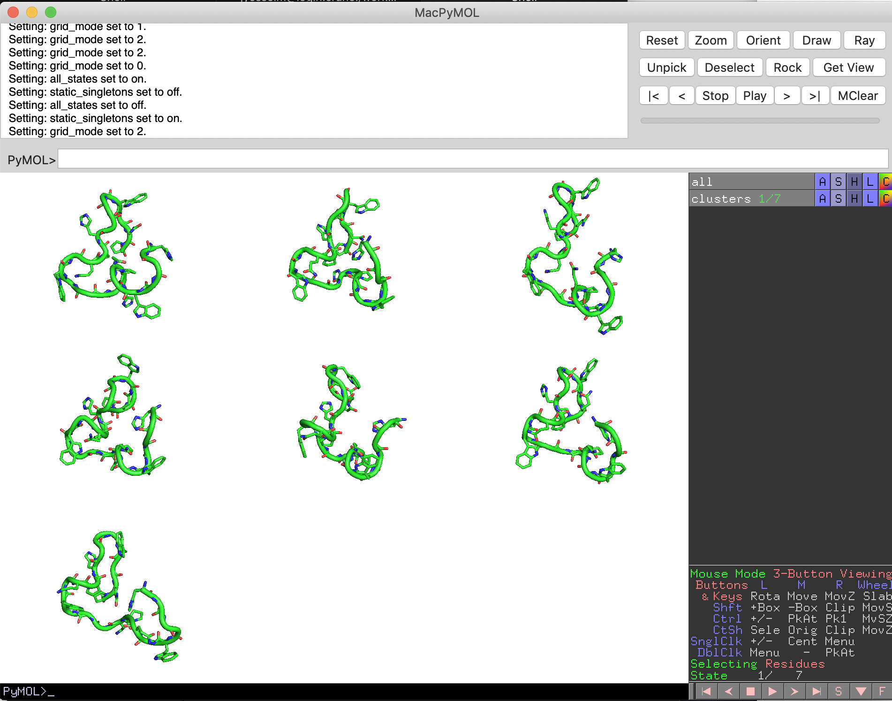


## Some Analysis in Pymol

Measuring distances:

wizard -> measurements 

Select 2 atoms, I picked residue 83 atom OE1 and residue 61 atom N with the distance being 5.0 at the beginning of the simulation

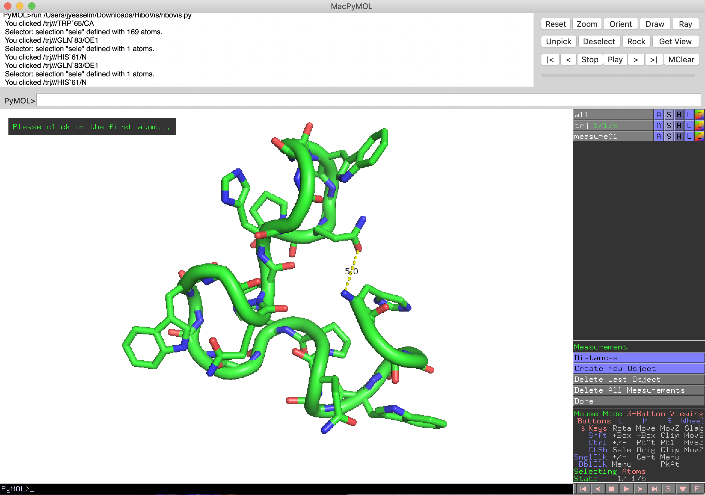

But at the end its much larger

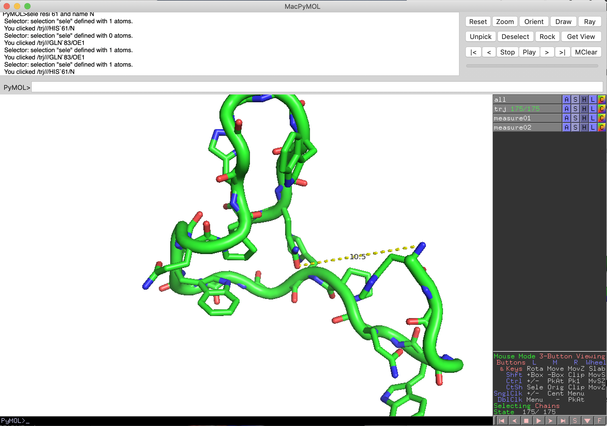


### Computing the surface 

Pymol also supports generation of surfaces which can be useful for seeing how ligands sit in a binding pocket

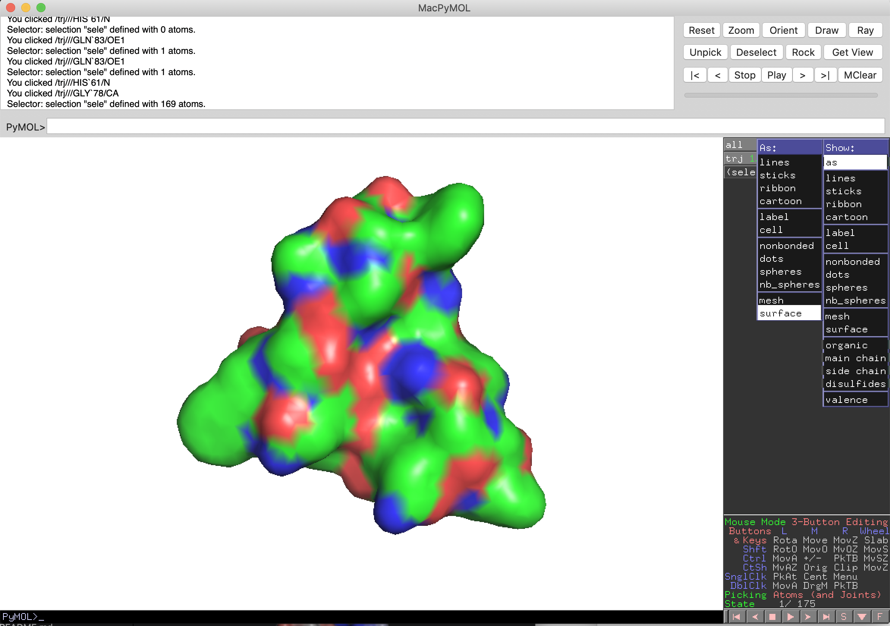


### Electrostatic surface

Looking at the computed electrostatic surface can be quite useful when looking for a potential active site or binding domain.

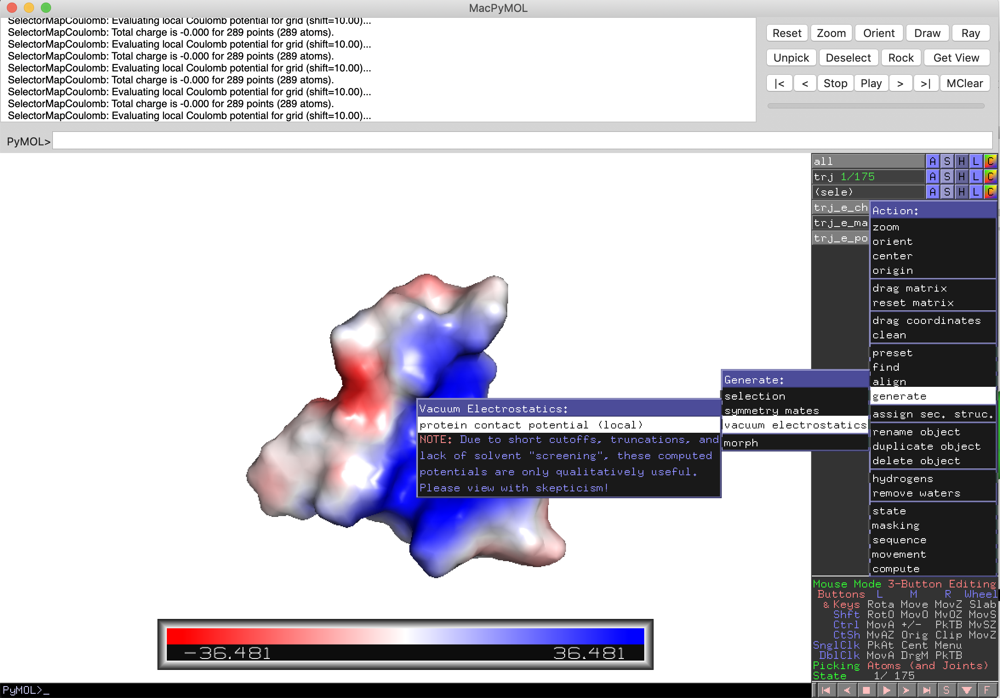


### Finding polar contacts or hydrogen bonds

finding all hydrogen bonds is often a common task to understand the overrall structure of protein. 

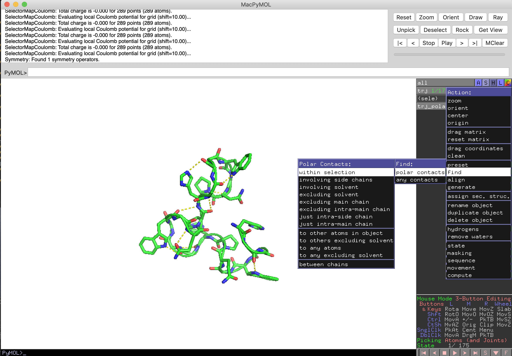

